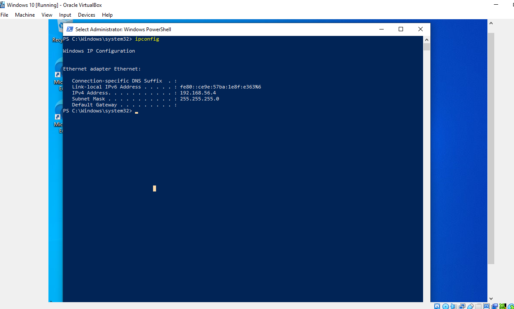
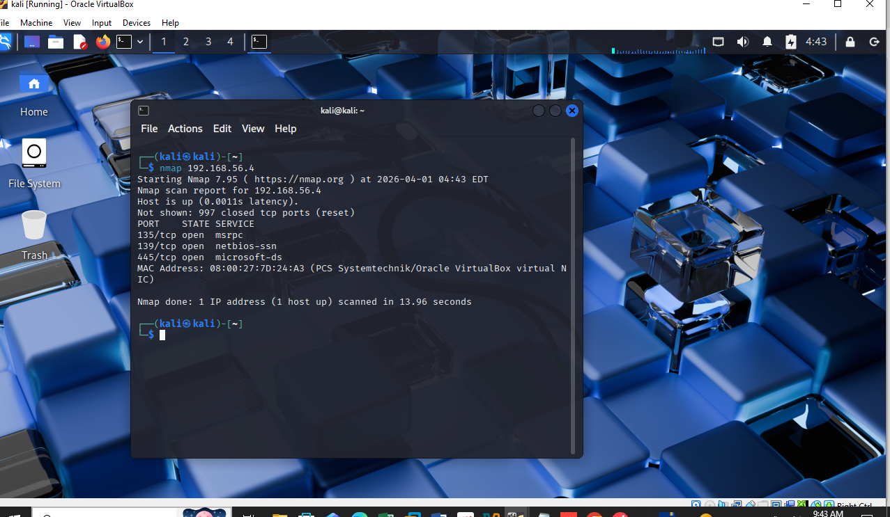
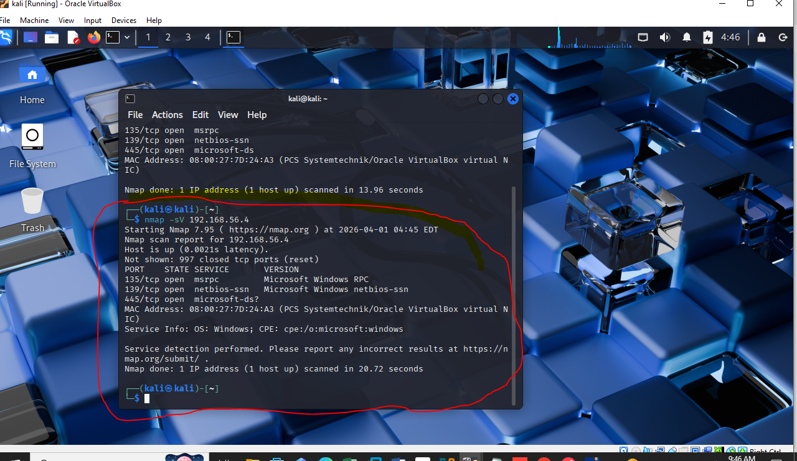

# Network Scanning & Enumeration Lab

## Objective
To perform network reconnaissance using Nmap and identify open ports and services.

## Tools Used
- Nmap
- Kali Linux
- Windows 10

## Steps

### 1. Identified Target IP
Used ipconfig on Windows machine.

### 2. Performed Basic Scan
Executed:
nmap <TARGET-IP>

### 3. Service Enumeration
Executed:
nmap -sV <TARGET-IP>

## Findings
- Identified open ports
- Detected running services

## Skills Gained
- Network scanning
- Service enumeration
- Reconnaissance techniques
