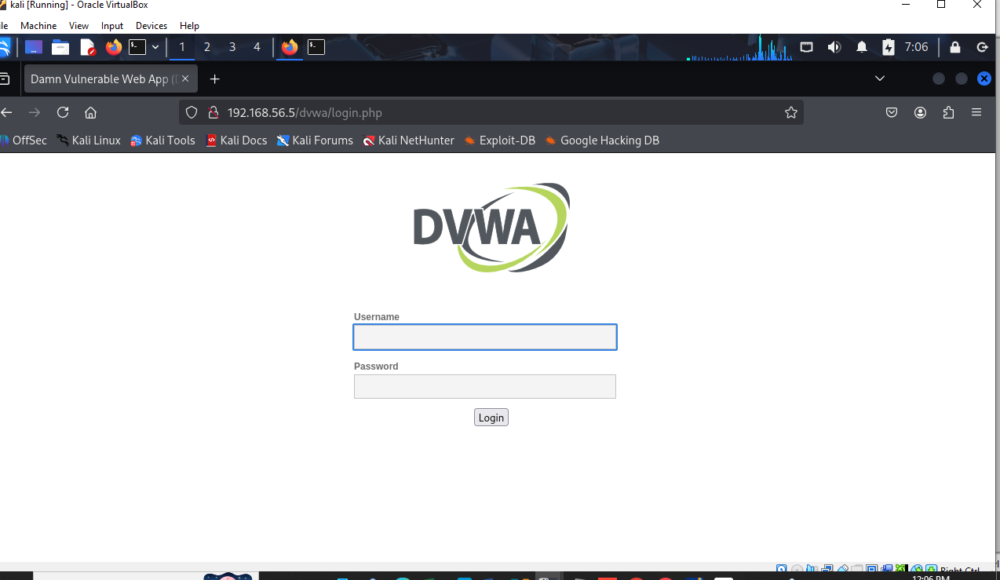
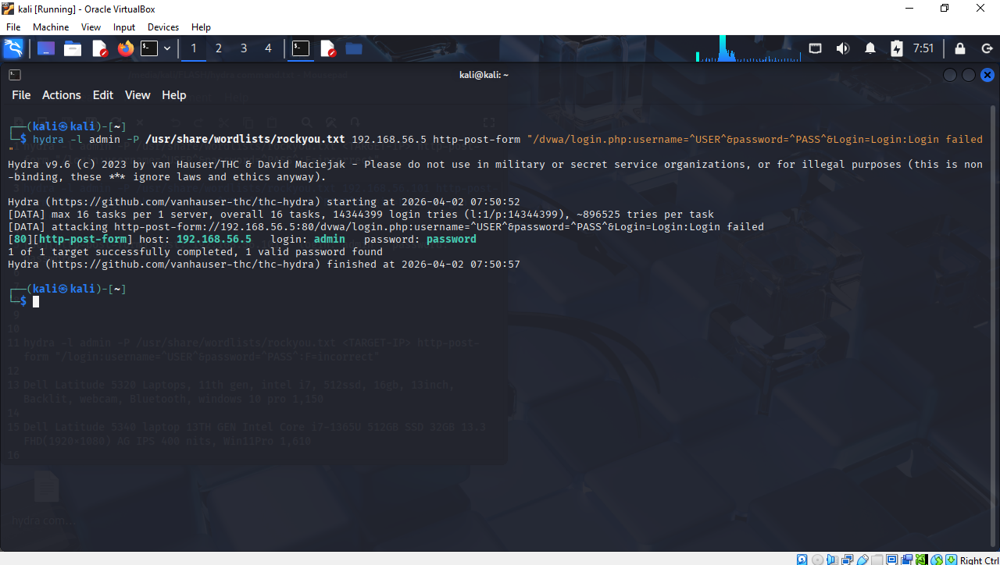

# Password Cracking Lab

## Objective
To test password strength using brute-force techniques.

## Tools Used
- Hydra
- Kali Linux

## Steps

### 1. Identified Login Page

### 2. Executed Hydra Attack
Used rockyou wordlist.

### 3. Retrieved Credentials

## Findings
- Weak password detected
- System vulnerable to brute-force attack

## Skills Gained
- Password testing
- Brute-force attacks
- Authentication security
