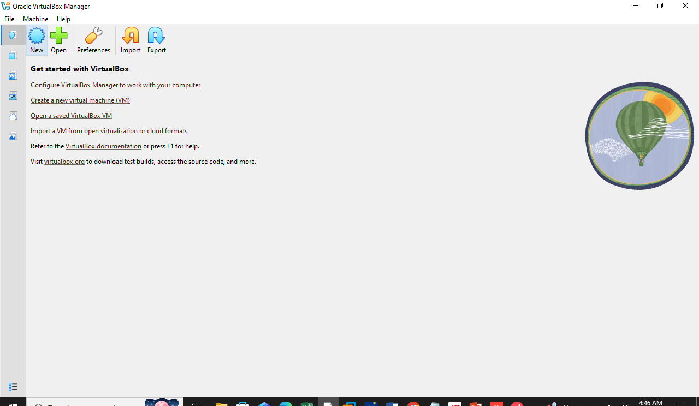
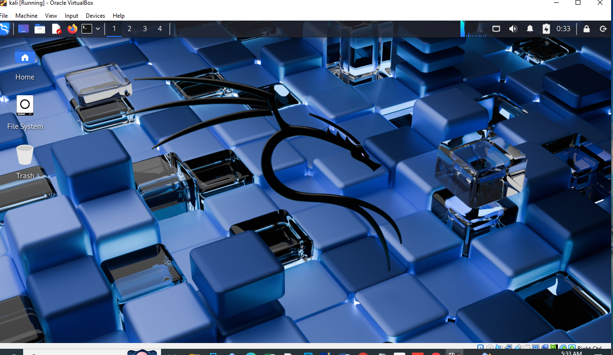
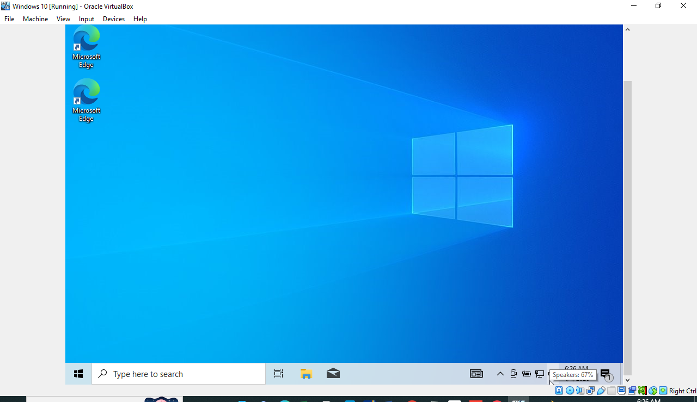
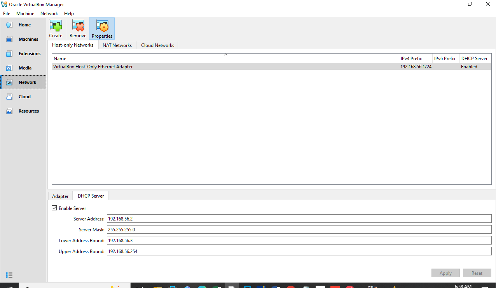
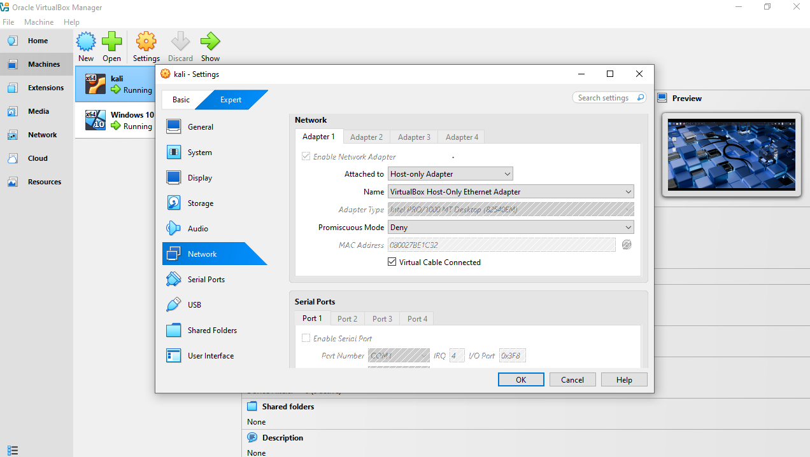
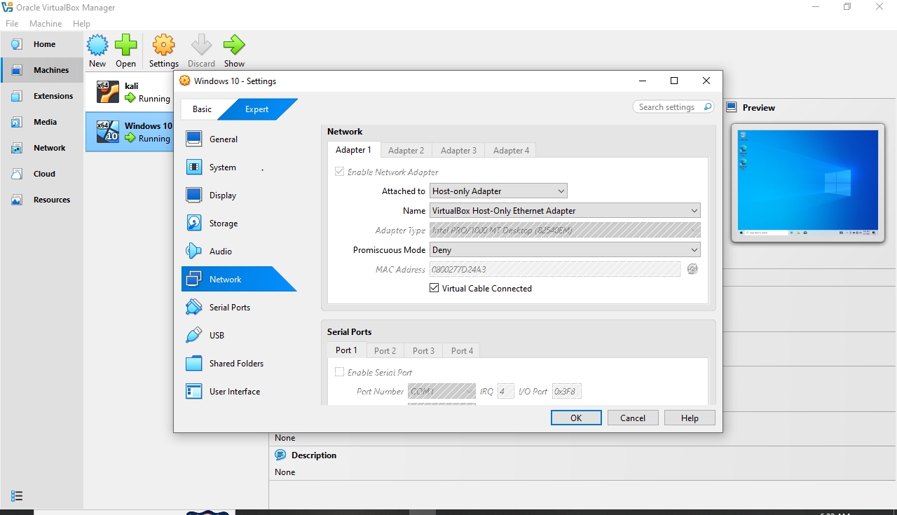
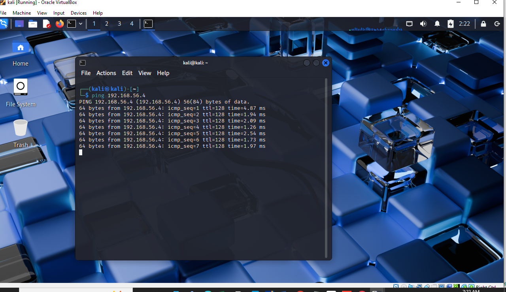

# Cybersecurity Virtual Lab Setup

## Project Overview
This project demonstrates the setup of a virtual cybersecurity lab environment using VirtualBox.

## Objective
To create an isolated lab environment for practicing penetration testing safely.

## Tools Used
- Oracle VM VirtualBox
- Kali Linux
- Windows 10

## Lab Setup Steps

### 1. Installed VirtualBox
VirtualBox was installed as the virtualization platform.

### 2. Created Kali Linux VM
- Allocated 2GB RAM and 25GB disk
- Installed Kali Linux OS

### 3. Created Windows 10 VM
- Allocated 2GB RAM and 50GB disk
- Installed Windows 10 OS

### 4. Configured Network
- Set both VMs to Host-Only Adapter
- Ensured both machines are on same subnet

### 5. Verified Connectivity
- Used ping test from Kali to Windows
- Successful communication confirmed

## Screenshots

## Key Outcome
- Successfully built an isolated cybersecurity lab
- Enabled communication between virtual machines

## Skills Gained
- Virtualization setup
- Network configuration
- Basic troubleshooting

## Use Case
This lab can be used for penetration testing practice, vulnerability assessment, and cybersecurity training.
